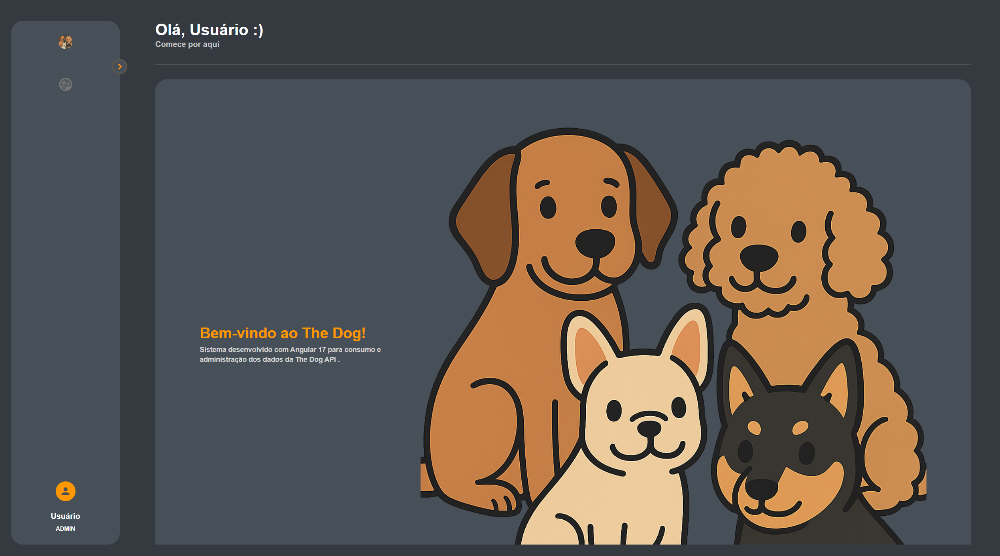
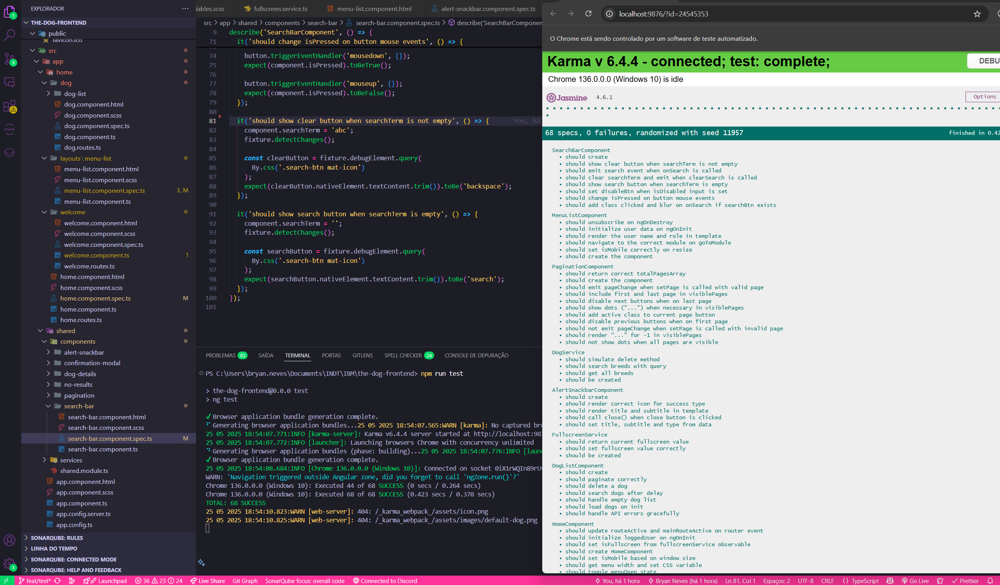
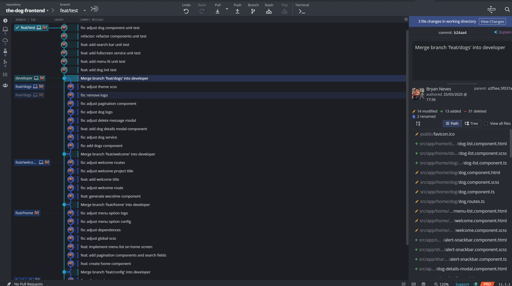

# THE DOG FRONTEND

Este projeto foi gerado usando o [Angular CLI](https://github.com/angular/angular-cli) versão 17.2

## 📦 Sobre o Projeto

DogCrud é uma aplicação Angular que consome a [The Dog API](https://thedogapi.com/) para:

- Listar raças de cães
- Visualizar detalhes de raças
- Exibir imagens
- Aprender mais sobre as características de cada cão

## 🗂️ Estrutura de Pastas

A arquitetura do projeto foi pensada para manter a organização e escalabilidade da aplicação:

```bash
src/
├── app/
│ ├── home/ # Funcionalidades principais da aplicação
│ │ ├── dog/ # Lógica e interface de listagem/visualização de raças
│ │ ├── layouts/ # Estrutura visual (ex: header, sidebar)
│ │ └── welcome/ # Página de boas-vindas
│ ├── shared/ # Elementos compartilhados
│ │ ├── components/ # Componentes reutilizáveis (ex: search-bar)
│ │ └── services/ # Serviços (ex: THE DOG API)
│ └── app.routes.ts # Configuração de rotas
├── assets/ # Imagens, fontes e recursos estáticos
├── environments/ # Arquivos de ambiente (ex: development)
└── scss/ # Estilos globais
```

## ▶️ Rodando o Servidor de Desenvolvimento

Antes de iniciar o servidor, instale as dependências do projeto com o comando:

```bash
npm install
```

Para iniciar o servidor local:

```bash
ng serve
```

## 🐳 Rodando com Docker

1. Build e execute o container:

```bash
docker-compose up --build

```

Depois, acesse [http://localhost:4200/](http://localhost:4200/). O app recarregará automaticamente ao salvar arquivos.



## ⚙️ Gerando Componentes com o Angular CLI

```bash
ng generate component component-name

```

Para ver todos os esquemas disponíveis:

```bash
ng generate --help
```

## 🛠️ Build

Para compilar o projeto:

```bash
ng generate --help
```

O resultado será salvo no diretório dist/.

## ✅ Testes Unitários

O projeto possui testes unitários escritos com **Jasmine** e executados com **Karma**.

### Para rodar os testes:

```bash
ng test
```

O comando abre uma janela no navegador com o resultado da suíte de testes, atualizando automaticamente com cada modificação.



### Os testes validam:

- ✅ Comportamento dos componentes (ex: clique em botões, emissão de eventos)
- ✅ Reações a inputs e interações do usuário
- ✅ Serviços com mocks da API
- ✅ Rotas e navegação entre páginas

---

## 🌱 GitFlow e Versionamento

O projeto segue o fluxo de desenvolvimento **GitFlow**:

- `main`: branch de produção
- `develop`: branch de desenvolvimento
- `feature/nome-da-feature`: novas funcionalidades
- `bugfix/nome-do-bug`: correções específicas

---



## Recursos Adicionais

Para obter mais informações sobre o uso do Angular CLI, incluindo referências detalhadas de comando, visite o [Angular CLI Overview and Command Reference](https://angular.dev/tools/cli) página.
